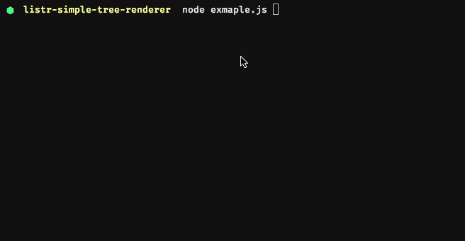

# listr-simple-tree-renderer 

> [Listr](https://github.com/SamVerschueren/listr) simple tree renderer

 

Shows simple task list in non-concurrent mode to support long task list with collapsed items.

Inspired by [listr-verbose-renderer](https://github.com/SamVerschueren/listr-verbose-renderer) and [listr-update-renderer](https://github.com/SamVerschueren/listr-update-renderer)

## Install

```
$ npm install --save listr-simple-tree-renderer
```


## Usage

```js
const SimpleTreeRenderer = require('listr-simple-tree-renderer');
const Listr = require('listr');

const list = new Listr([
	{
		title: 'foo',
		task: () => Promise.resolve('bar')
	},
	{
        title: 'Output can be function to change text',
        task: (context, task) => {
            task.output = () => {
                return `${figures.tick} Custom render`
            }
        }
    }
], {
	renderer: SimpleTreeRenderer
});

list.run();
```

> This renderer supports non-TTY environments.
> 
> Task spinners are not used to allow rendering tree with history.


## Options

These options should be provided in the [Listr](https://github.com/SamVerschueren/listr) options object.

### indentString

Type: `boolean`
Default: `true`

Append every indention based on corresponding level task.

## Spinner

Need to show spinner? Use custom rendering which will clear the output before changing task.


```js
const logUpdate = require('log-update')
const ElegantSpinner = require('elegant-spinner')

/**
 * Shows spinner and runs given task. Returns value from the promise task.
 *
 * Do not output any data within promise task.
 *
 * @param {string} title
 * @param {Function} promiseTask
 * @return {Promise<any>}
 */
module.exports = async function (title, promiseTask) {
    function cancel () {
        clearInterval(interval)
        logUpdate.clear()
    }

    const spinner = ElegantSpinner()

    // Show the spinner
    const interval = setInterval(() => {
        logUpdate(spinner() + ' ' + title)
    }, 100)

    try {
        const response = await promiseTask()
        cancel()
        return response
    } catch (e) {
        cancel()
        throw e
    }
}

task = {
    title: 'test',
    task: (context, task) => showSpinner('Loading', async () => {
    	return await somethingThatWillReturnTitle()
    }).then((title) => {
        task.output = title
    })
}
```

## Related

- [listr](https://github.com/SamVerschueren/listr) - Terminal task list
- [listr-update-renderer](https://github.com/SamVerschueren/listr-update-renderer) - Listr update renderer
- [listr-silent-renderer](https://github.com/SamVerschueren/listr-silent-renderer) - Suppress Listr rendering output


## License

MIT © [Martin Kluska](https://github.com/pionl)
